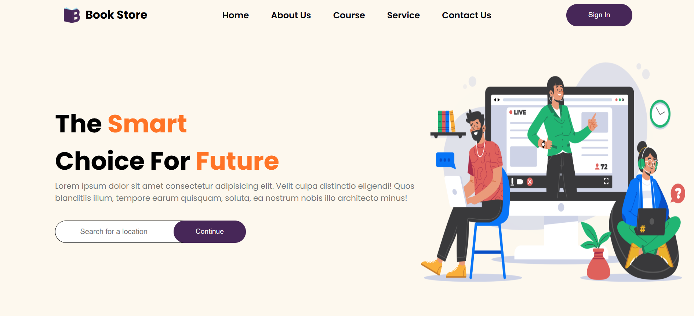

# 🎓 Basic E-Learning Website (HTML, CSS, JavaScript)

This is a basic front-end e-learning website with only two main pages:
- **Sign In Page**
- **Course Catalog Page**

---

## 🔍 Features

- 🔐 **Sign In Page**
  - Simple username/password input (non-functional, no backend)
  - Basic form validation using JavaScript

- 📘 **Course Catalog**
  - Static list of courses with titles, images, and short descriptions
  - Responsive layout using CSS Flexbox or Grid

---

## 💻 Tech Used

- **HTML5** – Structure
- **CSS3** – Styling and layout
- **JavaScript** – basic interactivity

